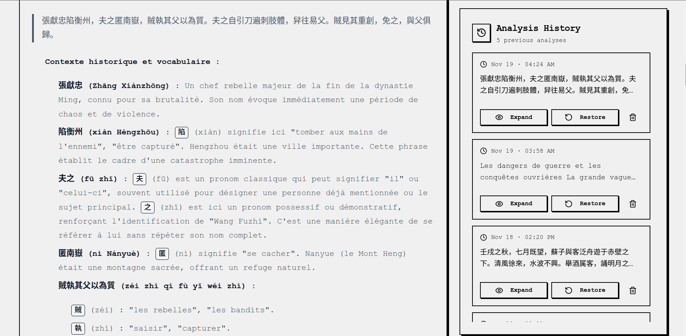
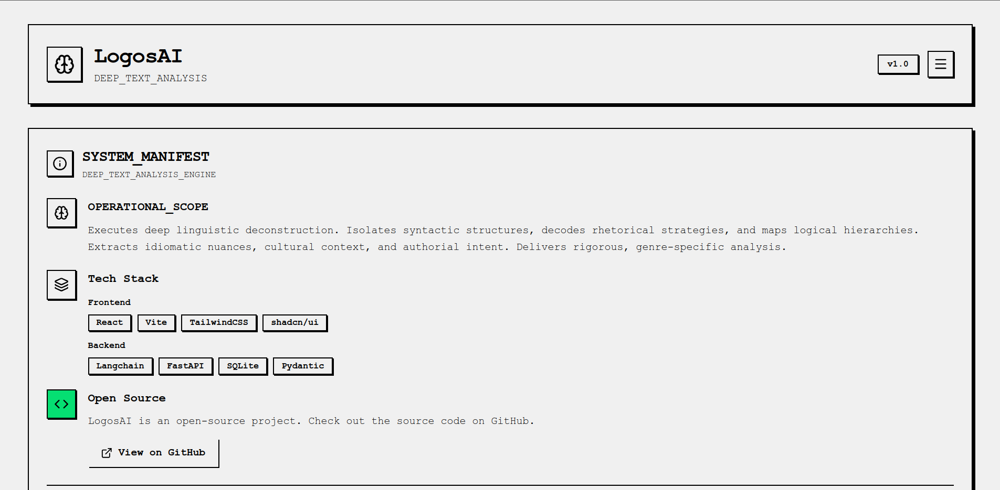

# LogosAI

[](https://huggingface.co/spaces/IvanMiao/LogosAI)

LogosAI is an AI-powered tool designed for deep language learning, capable of analyzing complex texts ranging from news articles to philosophical works.






## Tech Stack

**Frontend:**
React, TypeScript, Vite, Tailwind CSS, shadcn/ui

**Backend:**
LangChain/LangGraph, FastAPI, PostgreSQL, SQLAlchemy, Pydantic

## Getting Started

### Option 1 - Docker (Recommended)

1. Copy `.env.copy` to `.env`, then add your API key to the env file.

2. Execute this command:
```bash
docker compose up -d
```

### Option 2 - Manual Installation

**Prerequisites**

-   Node.js (v18 or higher)
-   Python (v3.13 or higher)
-   PostgreSQL (v16 or higher)

1.  Copy `.env.copy` to `.env`, then add your API key and Database credentials.

2.  **Backend Setup:**

    Ensure your PostgreSQL service is running and the credentials in `.env` are correct.

    ```bash
    uv sync

    cd backend
    uv run uvicorn app:app --reload
    ```

    The backend will be running at `http://127.0.0.1:8000`.

3.  **Frontend Setup:**
    ```bash
    cd ../frontend
    npm install
    npm run dev
    ```
    The frontend development server will be running at `http://localhost:5173`.

## Recent Updates

- **Architecture**: Refactored backend to use **Dependency Injection** and **Singleton Service** pattern for better state management and concurrency.
- **Database**: Migrated from SQLite to **PostgreSQL** for robust data persistence.
- **Frontend**: Migrated codebase from JavaScript to **TypeScript** for better type safety.

## TODO

- [ ] Dark mode
- [ ] Stream output
- [ ] Agent Refactor
