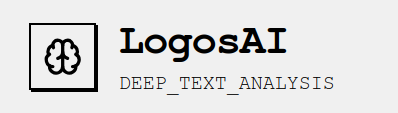

<div align="center">
  
</div>

# LogosAI

LogosAI is a source-grounded AI reading workspace for difficult texts. Readers
can import a text, ask for help on a selected passage, run a close reading, and
keep notes and AI outputs attached to their source context.

The current Workspace Alpha supports:

- pasted text and local `.txt` / `.md` files;
- a reader with persistent typography preferences;
- selection-level Explain, Translate, Vocab, and Note actions;
- document- and paragraph-level Close Read;
- local restoration of the active document, anchors, artifacts, and history;
- Gemini BYOK via the `X-Gemini-Key` request header.

Workspace data and the Gemini key are currently stored in browser
`localStorage`. The backend receives the key for each AI request and does not
persist it.

## Stack

- Frontend: React 19, TypeScript, Vite, Tailwind CSS, Radix UI
- Backend: Python 3.13, FastAPI, Pydantic, LangChain/LangGraph
- Models: Gemini 2.5 Flash or Pro; Flash Lite for detection and correction
- Delivery: Docker image served by FastAPI and deployed on Fly.io

PostgreSQL scaffolding remains in the repository but is not part of the active
Workspace request or persistence path.

## Local Development

Prerequisites: Node.js 20+, Python 3.13, [`uv`](https://docs.astral.sh/uv/), and
`npm`.

Start the backend:

```bash
cd backend
uv sync
uv run uvicorn app:app --reload
```

Start the frontend in another terminal:

```bash
cd frontend
npm ci
npm run dev
```

Open `http://localhost:5173`. Vite proxies `/api/*` to
`http://127.0.0.1:8000`. Add a Gemini API key from the Settings page before
using AI actions; local notes work without a key.

No environment file or PostgreSQL instance is required for the default local
workflow. Optional observability configuration is described in
[Project Reference](./docs/PROJECT.md).

## Docker

```bash
docker compose up --build
```

Open `http://localhost:3000`. The Compose file starts one FastAPI container;
the image builds the frontend and FastAPI serves the resulting static bundle.
If port `3000` is already in use, select another host port without changing
the container configuration:

```bash
LOGOSAI_PORT=3001 docker compose up --build
```

## Error Monitoring

Sentry error monitoring is optional. With no DSN configured, both SDKs remain
disabled and the application behaves as before.

- Backend runtime: set `SENTRY_DSN`; optionally set `SENTRY_ENVIRONMENT` and
  `SENTRY_RELEASE`. `SENTRY_TRACES_SAMPLE_RATE` defaults to `0`.
- Frontend build: set `VITE_SENTRY_DSN`; optionally set
  `VITE_SENTRY_ENVIRONMENT`. Set `SENTRY_ORG`, `SENTRY_PROJECT`,
  `SENTRY_RELEASE`, and the build-only `SENTRY_AUTH_TOKEN` to upload source
  maps. The Docker build accepts the token as a BuildKit secret.

The default configuration sends errors only: tracing, replay, session
tracking, and breadcrumbs are off. Request bodies, cookies, user identity,
document fields, notes, and Gemini credentials are removed before events are
sent. Source maps are deleted from the production bundle after a successful
upload.

## Verification

Backend:

```bash
cd backend
uv run pytest
uv run ruff check .
uv run python -m evals.workspace_alpha
```

The eval command validates dataset structure only; it is not a model-quality
evaluation.

Frontend:

```bash
cd frontend
npm run lint
npm test
npm run build
```

## Documentation

- [Project Reference](./docs/PROJECT.md): current product boundaries,
  architecture, domain language, and runtime contracts.
- [Roadmap](./docs/ROADMAP.md): the only source of truth for priorities,
  evidence gates, and deferred work.
