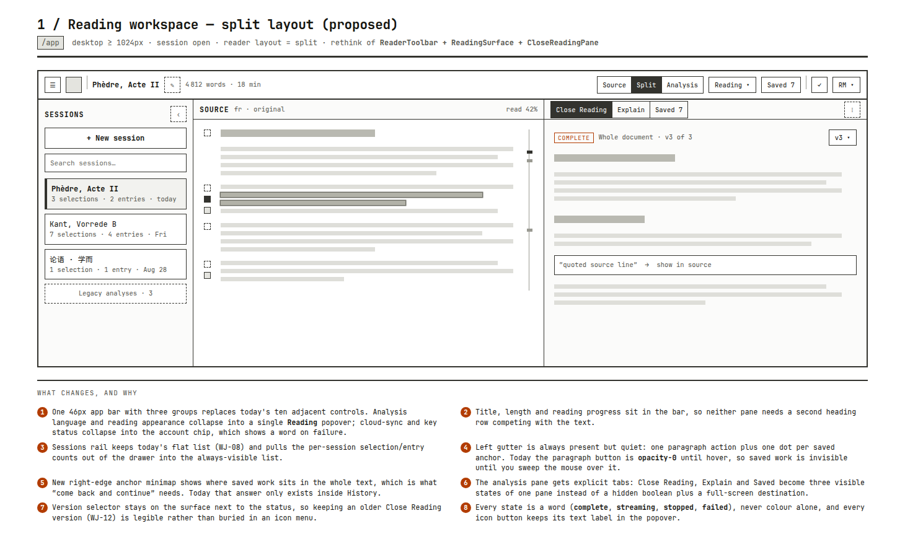
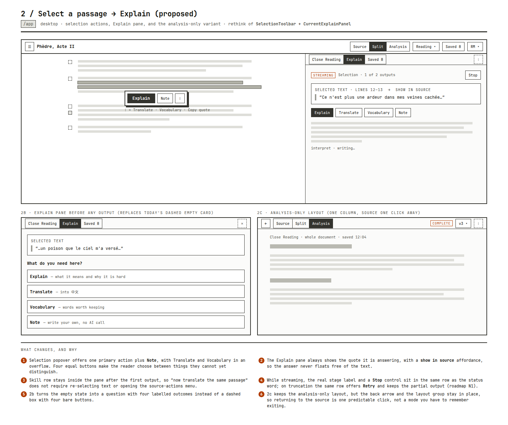
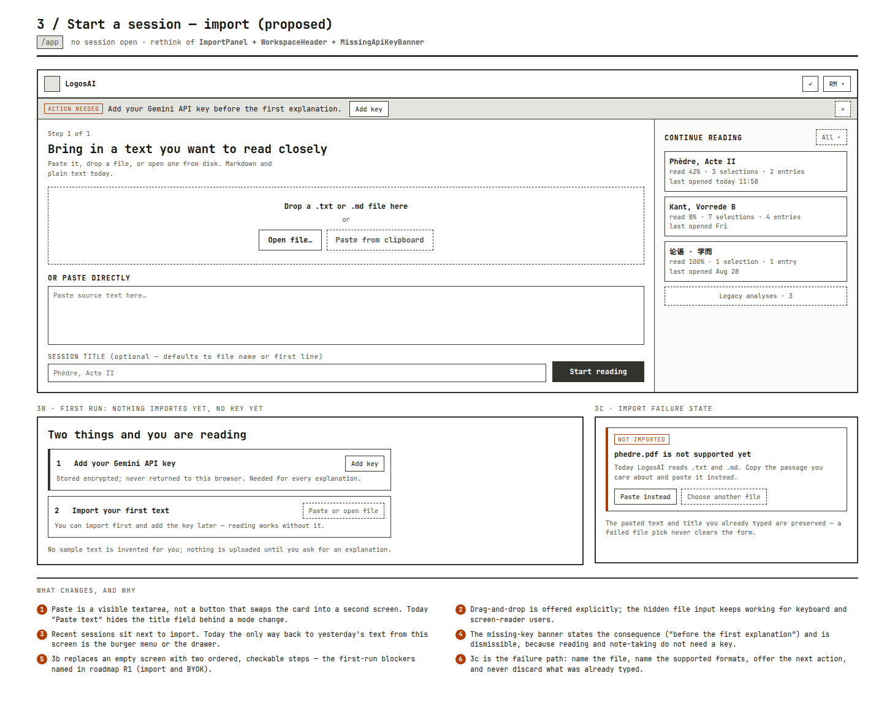
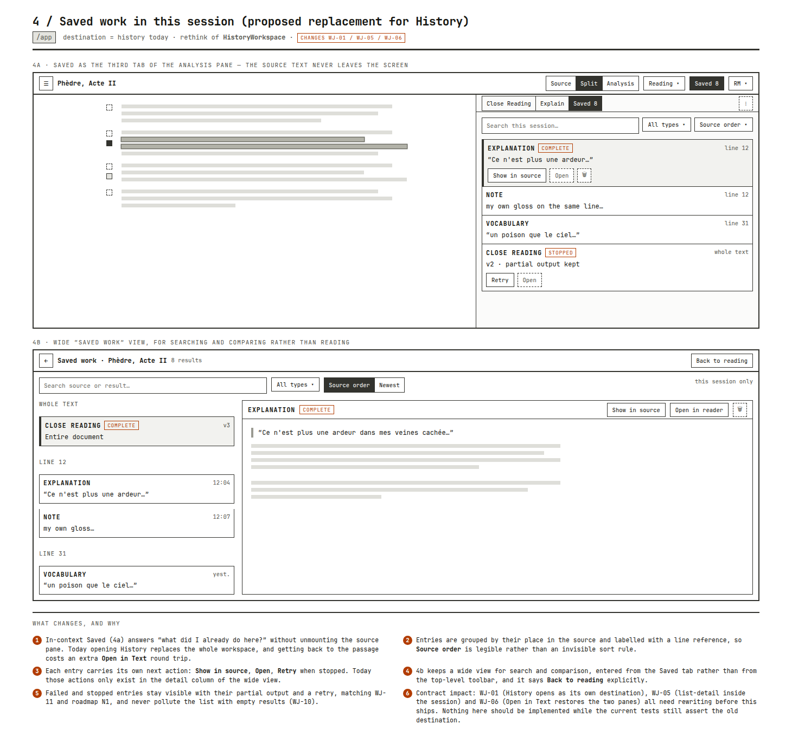
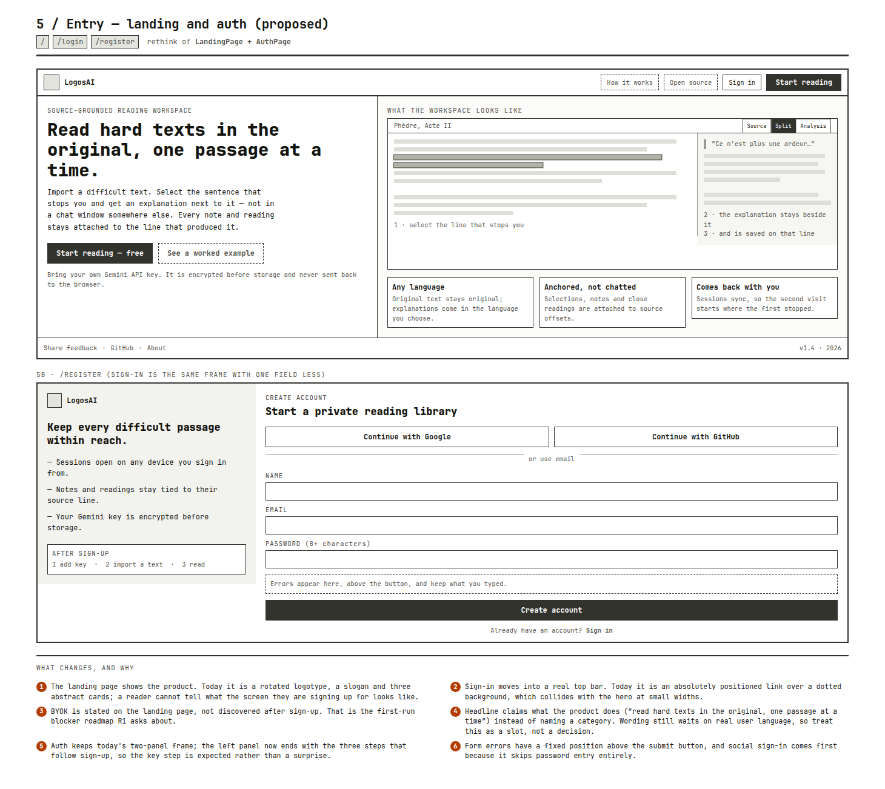
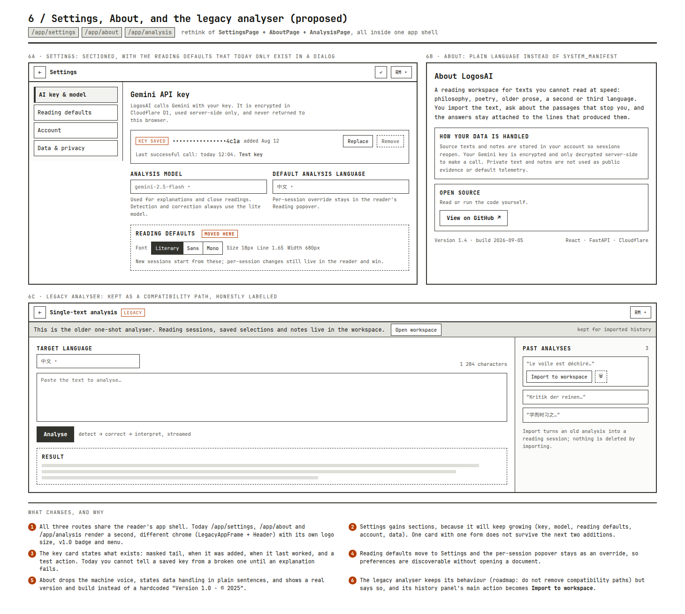
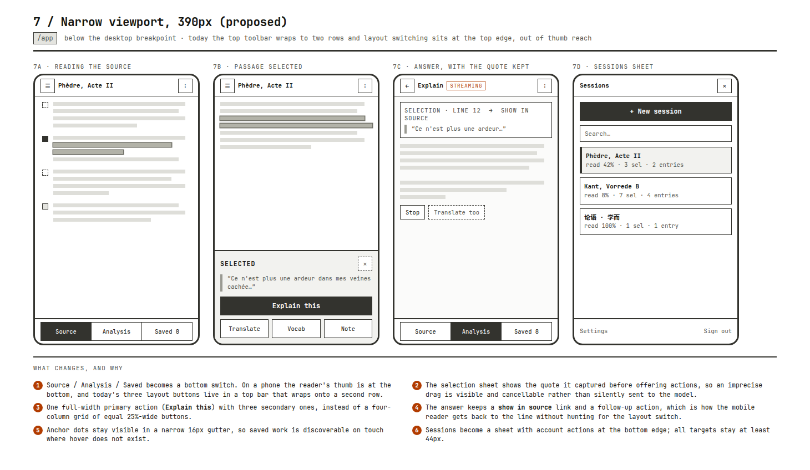

# 界面重思 Wireframes

- 状态：Proposal，未实施；本次只画线框，没有改动任何产品代码
- 更新：2026-09-07，依据当前 `frontend/` 实现与 [旅程契约](workspace-journey-contract.md) 校准
- 关系：现状见 [项目参考](../project.md)；优先级仍由 [路线图](../roadmap.md) 决定

线框只表达信息层级、状态可见性与动作位置，不表达视觉语言。现有
neo-brutalist 边框、阴影与 mono 品牌字保留，线框里的灰块代表文本，不代表配色。
每张图右下的编号说明对应“改什么、为什么”。

## 页面清单与对应实现

| 图 | 路由 / 状态 | 重思的实现 |
| --- | --- | --- |
| 1 | `/app` 有 session，split | `ReaderToolbar`、`ReadingSurface`、`CloseReadingPane` |
| 2 | `/app` 选区 → Explain | `ReadingSurface` 的 `SelectionToolbar`、`CurrentExplainPanel` |
| 3 | `/app` 无 session | `ImportPanel`、`WorkspaceHeader`、`MissingApiKeyBanner` |
| 4 | `/app` destination = history | `HistoryWorkspace` |
| 5 | `/`、`/login`、`/register` | `LandingPage`、`AuthPage` |
| 6 | `/app/settings`、`/app/about`、`/app/analysis` | `SettingsPage`、`AboutPage`、`AnalysisPage`、`LegacyAppFrame` |
| 7 | `/app` 窄屏 390px | 上述组件的窄屏分支 |

## 1 · 阅读工作台（split）

- 顶栏从十个并列控件收敛为三组：会话与标题 / 布局与 Reading / 账号。
  分析语言与阅读外观合并为一个 `Reading` 弹出层，cloud sync 与 key 状态合并进账号 chip。
- 段落 gutter 常驻但安静。现在段落 Explain 按钮 `opacity-0` 到 hover 才出现，
  已保存的工作在鼠标扫过之前不可见。
- 新增右缘 anchor minimap：整篇里哪里有已保存成果。这是“回来继续读”真正需要的信息，
  今天只能进 History 才能回答。
- 分析栏改为显式 tab（Close Reading / Explain / Saved），版本选择与状态词同排常驻，
  让 WJ-12 选中的旧版本可见而不是藏在 icon 菜单里。

## 2 · 选段 → Explain

- 选区浮层给一个主动作加 Note，Translate 与 Vocabulary 收进溢出菜单；
  四个等权按钮要求读者在还分不清差别时做选择。
- Explain 面板始终显示它在回答的引文，并提供“show in source”，答案不脱离原文。
- 技能行在首个输出之后保留在面板内，“同一段再翻译一次”不需要重新选区。
- streaming 时真实 stage 文案、`Stop` 与状态词同排；截断时同一排给 `Retry` 并保留
  partial output，对应路线图 N1。
- 空态从“虚线框 + 四个裸按钮”改为一个问题加四个写明结果的选项。

## 3 · 导入与开始 session

- 粘贴区直接可见，不再是一个把标题字段换掉的模式切换按钮。
- 显式提供拖放，同时保留隐藏 file input 供键盘与读屏使用。
- 最近 session 与导入并列。今天从这个屏幕回到昨天的文本只能走汉堡菜单或抽屉。
- 缺 key 横幅说明后果（“在第一次解释之前”）并可关闭，因为阅读与写 note 不需要 key。
- 首次运行给两步有序清单，对应路线图 R1 关注的 import 与 BYOK 阻断点；
  导入失败要说明格式、给下一步动作，且不清空已输入内容。

## 4 · 已保存工作（替代 History）

- 把 Saved 做成分析栏第三个 tab，原文不下线。今天打开 History 会替换整个工作台，
  回到原句还要再走一次 `Open in Text`。
- 条目按原文位置分组并标行号，`Source order` 成为可读的分组而不是隐形排序规则。
- 每个条目自带下一步动作：show in source / open / stopped 时 retry。
- 保留宽屏“Saved work”视图用于搜索与比较，入口从顶栏移到 Saved tab，并显式写
  `Back to reading`。
- **契约影响**：WJ-01、WJ-05、WJ-06 都断言 History 是独立 destination。
  这一页在改写契约与对应测试之前不应实施。

## 5 · 落地页与登录

- 落地页展示产品本身：一张 split 阅读界面的静态示意加三步说明。
  今天是旋转标题、口号和三张抽象卡片，读者看不出自己在注册什么界面。
- Sign in 进入真实顶栏，不再是压在点阵背景上的绝对定位链接。
- BYOK 写在落地页，而不是注册之后才发现。
- 标题文案是槽位不是结论：真实用户原话仍是路线图 R1 的缺口。
- 登录保留两栏框架，左栏结尾给出注册后的三步，让 key 这一步成为预期。

## 6 · 设置、关于、旧版分析

- 三条路由共用阅读器的 app shell。今天它们走 `LegacyAppFrame` + `Header`，
  是第二套 chrome，自带另一种 logo 尺寸、`v1.0` badge 和菜单。
- 设置分节（key 与 model / 阅读默认值 / 账号 / 数据与隐私），并把 key 状态说清楚：
  掩码尾号、添加时间、最后一次成功调用、test 动作。今天在解释失败之前无法区分
  有效 key 与失效 key。
- 阅读默认值移入设置，reader 内的弹出层保留为按 session 覆盖。
- 关于页改成普通语言，说明数据处理，并显示真实版本与构建时间，
  而不是硬编码的 `Version 1.0 · © 2025`。
- 旧版分析保留行为（路线图明确不移除兼容路径），但明确标注 legacy，
  历史面板的主动作改为“导入到 workspace”。

## 7 · 窄屏 390px

- Source / Analysis / Saved 改为底部切换。手机上拇指在下方，
  今天三个布局按钮在会换行的顶栏里。
- 选区面板先显示抓到的引文再给动作，选错可见、可取消。
- 一个全宽主动作加三个次动作，替代四等分 25% 宽按钮网格。
- 答案保留 show in source 与后续动作；anchor 点在 16px gutter 常驻，
  因为触屏没有 hover。

## 实施前需要的决定

1. Saved tab 是否取代 History destination。取代就要同次改写 WJ-01 / WJ-05 / WJ-06
   与旅程测试；不取代则第 4 张只保留分组、行号与条目级动作三项。
2. 阅读进度与 anchor minimap 需要 per-session 的滚动/偏移数据，
   路线图把 per-session scroll snapshot 列在 Later，需要单独取舍。
3. 顶栏合并会改动 aria 结构（布局按钮的 `aria-pressed`、History 的按钮语义），
   属于行为变化，需要同步契约。
4. 落地页与关于页的文案是槽位，等 R1 的用户原话再定。

按路线图“UI 连续阅读修复：小切片修复，不重建双栏”，建议的落地顺序是
第 1 张的 gutter 常驻与状态词、第 2 张的引文常显与 Stop/Retry 同排、
第 3 张的粘贴区与失败态，这些不改双栏结构也不改契约断言。
